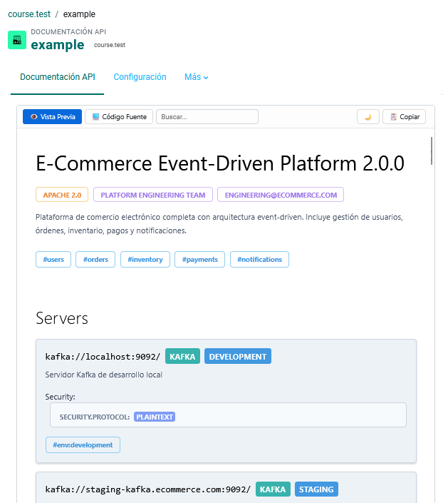

# Moodle APIDocs Course Module Plugin

**Native rendering of technical documentation (AsyncAPI, OpenAPI, Markdown) within Moodle.**

## 📖 The Story & Motivation

This plugin was born out of a specific need in **Computer Science Campuses and Technical Training Environments**.

In typical LMS environments, sharing API specifications usually means uploading a raw YAML file for students to download, or embedding an external URL (SwaggerHub, etc.) via iframe. Neither solution provides a seamless learning experience.

We wanted to bring the developer experience (DX) directly into the course. Students should be able to read, explore, and implement APIs **without leaving the Moodle interface** and without depending on external tools that might be blocked by campus firewalls.

### 💡 The Inspiration

Our main inspiration was the **GitLab default OpenAPI viewer**. 

We loved how GitLab detects a `swagger.yaml` or `openapi.json` file in a repository and simply *renders* it. It's clean, native, and immediate. We wanted to replicate that "zero-friction" experience inside Moodle activities: you upload the spec, Moodle renders the documentation. Simple.

## 🚀 Key Features

* **Offline First / Privacy Focused:** Unlike other plugins that rely on CDNs (unpkg/jsdelivr), this plugin injects the rendering engines (React, AsyncAPI Standalone, Swagger UI) directly from the server's local storage. It works perfectly in **Intranets** or air-gapped environments.
* **AsyncAPI v3 Support:** Native support for the latest Event-Driven Architecture specifications (Kafka, MQTT, WebSockets) using the official React Standalone component.
* **Clean UI:** Removes Moodle's standard clutter (navigation blocks, footers, completion buttons) to provide a "Full Focus" reading mode, similar to professional documentation sites.

## 📄 Supported Formats

1.  **AsyncAPI (v2.0 - v3.0):**
    * Renders utilizing the *AsyncAPI React Component*.
    * Supports complex schemas and event-driven definitions.
### **Example**
   

2.  **OpenAPI (Swagger v3):**
    * Renders using *Swagger UI*.
    * Interactive "Try it out" functionality (if the API endpoint is accessible).
### **Example:**
   

3.  **Markdown (.md):**
    * Renders GitHub-Flavored Markdown.
    * Perfect for Readmes, changelogs, and general technical guides.

## 🛠 Installation
1.  Clone this repository into your Moodle `mod/` directory:
    ```bash
    git clone [https://github.com/x-name15/moodle-apidocs-course-module.git](https://github.com/x-name15/moodle-apidocs-course-module.git) mod/apidocs
    ```
2.  Log in to Moodle as Administrator.
3.  Run the database upgrade/installation process.

## 🤝 Contributing
Pull requests are welcome, always :D

## 📝 License
Licensed under the [GNU General Public License v3](http://www.gnu.org/copyleft/gpl.html).
